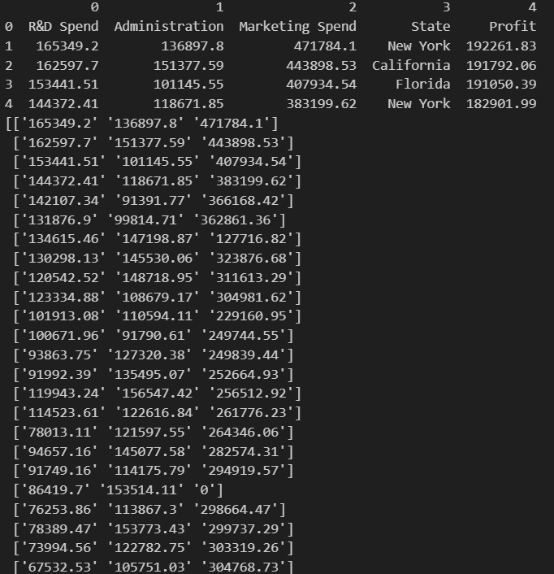
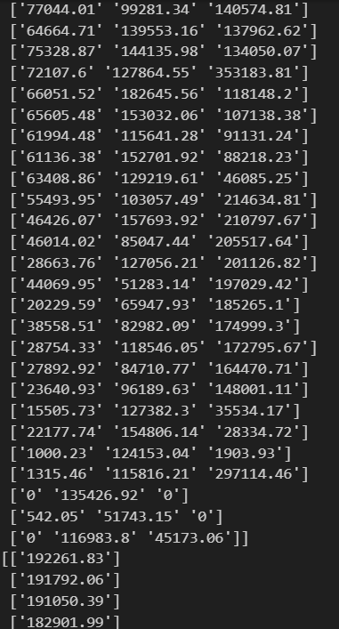
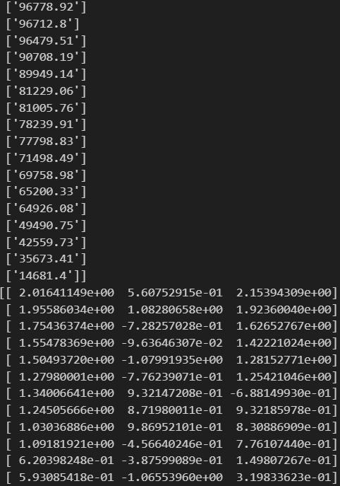
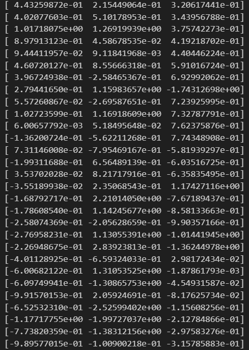
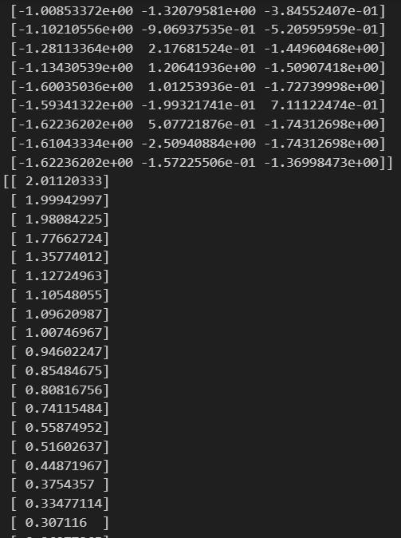

# Implementation-of-Linear-Regression-Using-Gradient-Descent

## AIM:
To write a program to predict the profit of a city using the linear regression model with gradient descent.

## Equipments Required:
1. Hardware – PCs
2. Anaconda – Python 3.7 Installation / Jupyter notebook

## Algorithm
1. Import necessary libraries: `numpy`, `pandas`, and `StandardScaler` from `sklearn`.
2. Define the `linear_regression` function to perform gradient descent and update `theta` iteratively.
3. Read the dataset from `50_Startups.csv` and print the first few rows to verify data.
4. Extract input features (`x`) and target variable (`y`) from the DataFrame.
5. Convert `x` to a float type for consistency.
6. Scale `x` and `y` using `StandardScaler` to normalize the data.
7. Train the linear regression model using the `linear_regression` function and obtain `theta`.
8. Create a new sample input (`new_data`) and scale it using the fitted `scaler`.
9. Make a prediction by computing the dot product of `theta` and the scaled input, including the intercept term.
10. Inverse-transform the predicted value to return it to the original scale.
11. Print the predicted value.

## Program:
```python
# Program to implement the linear regression using gradient descent.
# Developed by: Muhammad Afshan A
# RegisterNumber:  212223100035
import numpy as np
import pandas as pd
from sklearn.preprocessing import StandardScaler
def linear_regression(X1,y,learning_rate=0.01,num_iters=1000):
    X=np.c_[np.ones(len(X1)),X1]
    theta = np.zeros(X.shape[1]).reshape(-1,1)
    for _ in range(num_iters):
        predictions = (X).dot(theta).reshape(-1,1)
        errors = (predictions-y).reshape(-1,1)
        theta-=learning_rate*(1/len(X1))*X.T.dot(errors)
    return theta
data = pd.read_csv('50_Startups.csv',header=None)
print(data.head())


X=(data.iloc[1:, :-2].values)
print(X)


X1=X.astype(float)
scaler=StandardScaler()
y = (data.iloc[1:,-1].values).reshape(-1,1)
print(y)


X1_Scaled = scaler.fit_transform(X1)
Y1_Scaled = scaler.fit_transform(y)
print(X1_Scaled)
print(Y1_Scaled)


theta = linear_regression(X1_Scaled, Y1_Scaled)
new_data = np.array([165349.2,136897.8,471784.1]).reshape(-1,1)
new_Scaled = scaler.fit_transform(new_data)
prediction = np.dot(np.append(1, new_Scaled), theta)
prediction = prediction.reshape(-1,1)
pre = scaler.inverse_transform(prediction)
print(f"Predicition value: {pre}")

```

## Output:








## Result:
Thus the program to implement the linear regression using gradient descent is written and verified using python programming.
